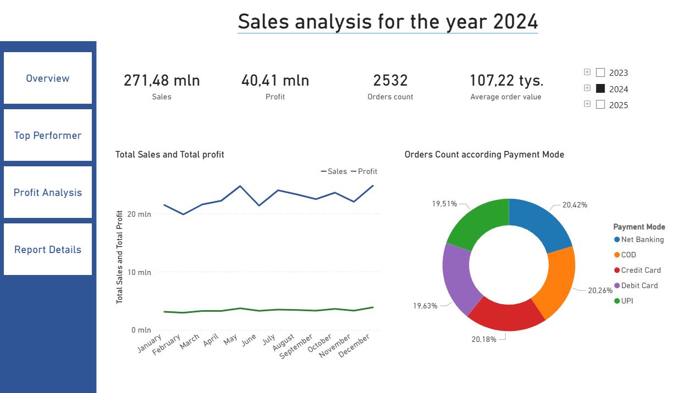
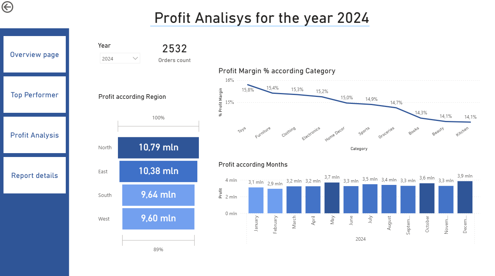
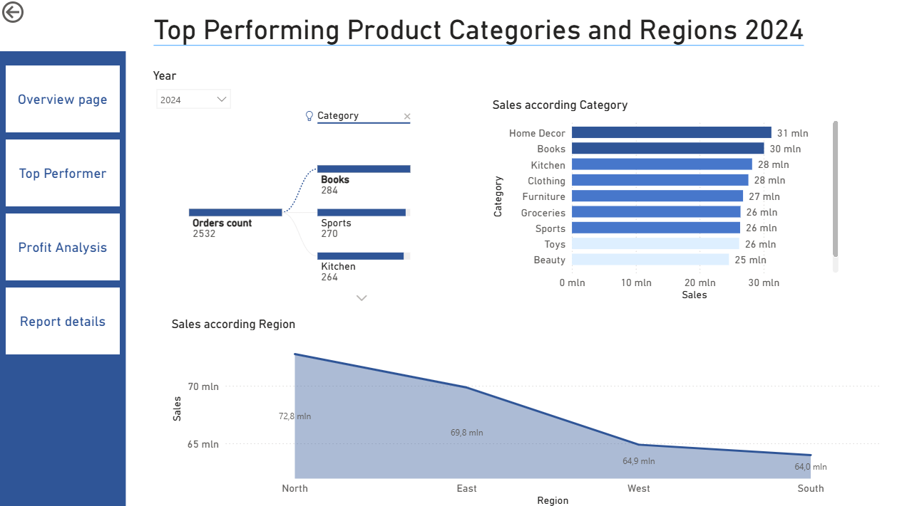
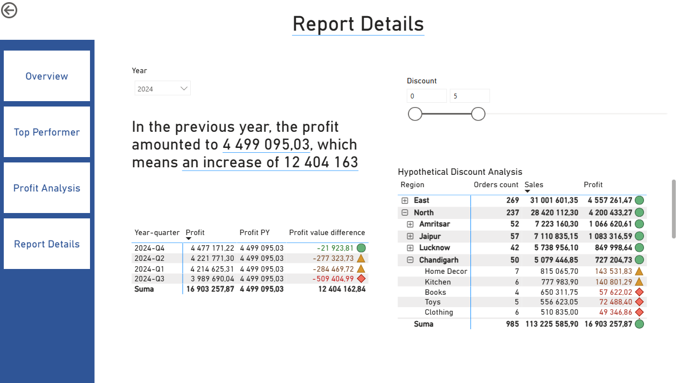

# Sales Dashboard - Power BI

## Opis projektu

Interaktywny dashboard stworzony w Power BI do analizy sprzedaży.

## Cel

Analiza:
- przychodów
- liczby zamówień
- najlepszych produktów
- trendów sprzedaży w czasie

## Technologie

- Power BI Desktop
- Power Query
- DAX
- Excel / CSV

## Najważniejsze funkcje

- KPI sprzedaży
- filtrowanie po regionach
- analiza miesięczna
- ranking produktów

## Zrzuty ekranu

## Pliki

- `Sales-dashboard.pbix` - raport Power BI
- dane z Kaggle - dane źródłowe

## Autor

Milena Rembowicz
